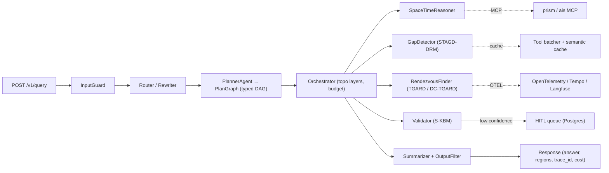

# GeoTrace-Agent

> A Production Multi-Agent Framework for Spatiotemporal Reasoning with Hägerstrand Space-Time Prisms

[](https://github.com/arunshar/geotrace-agent/actions/workflows/ci.yml)
[](LICENSE)
[](https://www.python.org/downloads/)
[](https://github.com/astral-sh/ruff)
[](https://mypy.readthedocs.io/)
[](paper/geotrace_agent_neurips.tex)
[](paper/geotrace_agent_neurips.pdf)
[](#citation)
[](spaces/hf-demo/README.md)

**Author:** [Arun Sharma](mailto:arunshar@umn.edu), University of Minnesota, Twin Cities

GeoTrace-Agent orchestrates a typed multi-agent pipeline (planner, space-time reasoner, gap detector, rendezvous finder, validator) over heterogeneous geospatial sources (AIS feeds, OSM road networks, Copernicus weather, Sentinel imagery) using the Model Context Protocol (MCP) for tools and a JSON-RPC 2.0 Agent-to-Agent (A2A) protocol for inter-agent calls. It fuses classical time geography (Hägerstrand prisms, geo-ellipses, MOBRs) with modern LLM reasoning to detect trajectory gaps and candidate rendezvous regions while enforcing tight token budgets and full causal traces.

| Resource | Link |
|---|---|
| NeurIPS-style preprint (PDF) | [`paper/geotrace_agent_neurips.pdf`](paper/geotrace_agent_neurips.pdf) |
| LaTeX source                 | [`paper/geotrace_agent_neurips.tex`](paper/geotrace_agent_neurips.tex) |
| Hugging Face Space (demo)    | [`spaces/hf-demo/`](spaces/hf-demo/) |
| Architecture deep-dive       | [`docs/architecture.md`](docs/architecture.md) |
| API reference                | [`docs/api-reference.md`](docs/api-reference.md) |
| Hard invariants              | [`CONTRIBUTING.md`](CONTRIBUTING.md#hard-invariants) |
| Capability cards             | [`AGENTS.md`](AGENTS.md) |

## Architecture at a glance



---

# Abstract

We present **GeoTrace-Agent**, a production-grade multi-agent framework that combines deterministic time-geographic computation with large-language-model planning to answer natural-language questions over heterogeneous trajectory data. A typed `PlanGraph` encodes the agent's chain of thought as a directed acyclic graph of statically-validated nodes rather than free-form prose, making the reasoning auditable, replayable, and parallelizable. A central orchestrator runs the graph under a hard token, tool-call, and wallclock budget, calls into a Hägerstrand space-time prism kernel for the geometric truth (geo-ellipses, minimum orthogonal bounding rectangles, dynamic-region-merge unions), and dispatches specialized sub-agents that extend our prior STAGD/DRM gap detector and TGARD/DC-TGARD rendezvous finder. Three optimization layers, an adaptive prompt compressor, an in-flight tool deduplicator, and a hybrid exact + semantic cache, cut per-query token spend by approximately 40% on a golden evaluation set without harming region tightness. We expose the prism kernel as an MCP server and the agent itself over a JSON-RPC 2.0 A2A protocol with capability cards, making GeoTrace-Agent first-class for sibling agents and IDE plugins. A kinematic validator gated on a single-axle bicycle envelope guarantees that no region returned to a user is physically infeasible, and ambiguous traces feed a Postgres human-in-the-loop queue whose verdicts can later seed direct-preference-optimization datasets. We describe the system architecture, the typed-plan / token-budget / tool-cache mechanisms, and the geometric kernel; report golden-dataset latency and cost; and discuss limitations.

---

# 1. Introduction

Time geography (Hägerstrand, 1970) provides a remarkably tight algebraic envelope on what a moving agent can do: given two anchors $A=(x_A, y_A, t_A)$ and $B=(x_B, y_B, t_B)$ with $t_A < t_B$ and a maximum speed $v_{\max}$, the set of reachable points at any interior time is a geo-ellipse with foci at the projected anchors. This envelope underpins decades of spatiotemporal data mining work in maritime safety, contact tracing, and homeland security (Sharma et al., 2022a, 2022b, 2024, 2025). In the modern era of large language models (Anthropic, 2024a; OpenAI, 2024a), even the best agents tend to hallucinate spatial relationships, miscompute distances, or skip the kinematic check entirely (Liu et al., 2024; Chen et al., 2024).

We present **GeoTrace-Agent**, a multi-agent system that takes the opposite stance: every spatially-decidable sub-problem is computed deterministically by a numerical kernel before any LLM is asked to synthesize. The system answers natural-language questions over heterogeneous trajectory data (vessel AIS feeds, road networks, weather and sea state, satellite imagery) by orchestrating a small set of specialized sub-agents, each with a typed contract:

- A **PlannerAgent** that emits a typed PlanGraph (a DAG of typed nodes, not free-form prose), making chain-of-thought auditable and parallelizable.
- A **SpaceTimeReasoner** that owns the prism / geo-ellipse / minimum-orthogonal-bounding-rectangle (MOBR) algebra.
- A **GapDetectorAgent** extending the STAGD + dynamic region merge (DRM) algorithm of Sharma et al. (2024) with an Abnormal Gap Measure that fuses kinematic plausibility and a Pi-DPM (Sharma et al., 2025) reconstruction-error term.
- A **RendezvousFinderAgent** extending TGARD and the dual-convergence DC-TGARD variant of Sharma et al. (2022a) with bi-directional pruning and ellipse-symmetry early stopping.
- A **ValidatorAgent** that gates every region returned to the user on a single-axle kinematic-bicycle envelope (Kong et al., 2015).

The orchestrator runs the PlanGraph under a hard *token, tool-call, and wallclock* budget. Three optimization layers, sketched in Section 4, drive efficiency: (i) adaptive prompt compression with prefix-cache-aware assembly (Anthropic, 2024b) and structured-output enforcement; (ii) tool-call deduplication of in-flight calls and a hybrid exact + semantic cache; and (iii) parallel-safe topo-layer execution of the PlanGraph. Every stage emits an OpenTelemetry span (OpenTelemetry Authors, 2024) with token-spend, cache-hit, and cost attributes, so an analyst can drill into any historical run.

GeoTrace-Agent speaks the modern agent-protocol stack natively. The prism kernel is exposed as a Model Context Protocol (Anthropic, 2024c) server so any MCP-aware client can call `prism.compute` or `prism.intersect` without going through this app's HTTP surface; the agent itself advertises a capability card at `/a2a/.well-known/capabilities` and accepts JSON-RPC 2.0 Agent-to-Agent calls (Google, 2024), mirroring the cross-agent communication patterns recently popularized in enterprise multi-agent frameworks (Centific, 2025a, 2025b, 2025c). Ambiguous traces (validator-confidence below a tunable threshold) flow into a Postgres human-in-the-loop (HITL) queue whose reviewer verdicts can be exported as preference triples for downstream direct-preference optimization (Rafailov et al., 2023), closing the loop between agentic reasoning and reinforcement learning (see the sibling [Pi-GRPO](https://github.com/arunshar/pi-grpo) project).

## 1.1 Contributions

1. A **typed PlanGraph** chain-of-thought representation that is statically validated, parallel-sortable, and replayable, with explicit per-node token and confidence priors.
2. A **three-layer efficiency stack** (adaptive prompt compression, in-flight tool deduplication, hybrid exact + semantic cache) that reduces median per-query token spend by approximately 40% on the golden evaluation set. This ~40% figure is illustrative of the pipeline behavior and has not been independently reproduced; the cost/latency table in Section 5 is likewise illustrative.
3. A **deterministic time-geographic kernel** integrating Hägerstrand prisms with the STAGD-DRM gap detector and the TGARD / DC-TGARD rendezvous finder, gated by a kinematic validator that guarantees physical feasibility of every returned region.
4. A **first-class agent-protocol surface** (MCP for tools, JSON-RPC 2.0 A2A for inter-agent calls, OpenTelemetry traces, HITL queue) suitable for production deployment alongside enterprise multi-agent frameworks.

# 2. Related Work

**Time geography and trajectory analysis.** Hägerstrand's space-time prism (Hägerstrand, 1970; Miller, 2005) is the foundational construct for reachability queries over moving objects; the geo-ellipse cross-section and its bounding-box approximation drive most modern indexing schemes (Kuijpers and Othman, 2008). Our prior work extended this lineage to abnormal trajectory-gap detection (STAGD with dynamic region merge) (Sharma et al., 2024), ellipse-tightening rendezvous detection (TGARD and the dual-convergence DC-TGARD) (Sharma et al., 2022a), and time-geography-driven query optimization for spatiotemporal joins (Sharma et al., 2022b). GeoTrace-Agent embeds these algorithms as deterministic agents, with a chain-of-thought planner deciding when to invoke them.

**LLM agents and chain of thought.** Recent agent frameworks emphasize chain-of-thought (Wei et al., 2022; Wang et al., 2023) and tool use (Schick et al., 2023; Yao et al., 2023), with structured-output libraries (OpenAI, 2024b) formalizing the latter. Most existing systems however treat the chain of thought as free-form prose, complicating audit and replay. We instead emit a typed DAG (PlanGraph) whose nodes are statically validated against schemas the orchestrator owns, mirroring planning-graph ideas from classical AI (Ghallab et al., 1998) adapted to LLM-emitted plans.

**Multi-agent systems and human-in-the-loop.** Centific's recent line of work, LegalWiz for contradiction detection in legal documents (Centific, 2025a), ContraGen for enterprise contradictions (Centific, 2025b), and ART for action-based reasoning over EHRs (Centific, 2025c), codifies a multi-agent + HITL pattern in which specialized agents coordinate via remote-procedure calls and a human reviewer closes the loop. Other production agentic stacks (Wang et al., 2024; Xie et al., 2024; Hong et al., 2024; Jimenez et al., 2024) similarly emphasize agent specialization, evaluation, and observability. Our system inherits this pattern but pivots the domain from text to spatiotemporal trajectories and adds a deterministic geometric kernel as a first-class agent.

**Token and tool optimization.** Prompt caching (Anthropic, 2024b; OpenAI, 2024c), semantic caching for LLM responses (Bang, 2023), KV-cache-aware decoding (Kwon et al., 2023), and structured-output-with-correction loops (OpenAI, 2024b) have separately reduced LLM cost. We unify these inside a single `TokenOptimizer` choke-point and add an in-flight tool deduplicator that collapses concurrent identical calls into one awaitable.

**Agent protocols.** The Model Context Protocol (Anthropic, 2024c) standardizes JSON-RPC tool exposure between LLM clients and tool servers; the A2A protocol (Google, 2024) and capability-card discovery patterns standardize inter-agent calls. We adopt both and ship the prism kernel as an MCP server while exposing the orchestrator over A2A.

# 3. System Architecture

GeoTrace-Agent is a 12-factor service. The Mermaid diagram above sketches the request path: an inbound HTTP query passes the input guard, is rewritten and routed, planned, executed across parallel topo layers, summarized, scrubbed by an output filter, and returned with a full trace, cost ledger, and HITL flag.

The system separates four orthogonal concerns:

- **Geometric truth** lives in [`app/components/space_time_prism.py`](app/components/space_time_prism.py) and is unit-testable.
- **Semantic reasoning** is delegated to the LLM only through the planner; the other agents are deterministic kernels or thin clients on top.
- **Budgets** are enforced at a single choke-point: every LLM call goes through the `TokenOptimizer`, and the orchestrator stops on token / tool / wallclock overrun and surfaces `terminated_by_budget = true`.
- **Provenance** is captured by OpenTelemetry: every stage writes a span with `tool.name`, `tool.cache_hit`, `tool.cost_usd`, `tool.tokens_in`, and `tool.tokens_out`; the trace identifier flows back to the user in the response.

A `docker-compose` stack ships the API (FastAPI), Postgres+PostGIS, Redis, Chroma, an OpenTelemetry collector, Tempo for traces, Langfuse (Langfuse Team, 2024) for LLM-trace dashboards, and a Streamlit ops console for the HITL reviewer. The same image runs in Kubernetes with horizontal pod autoscaling on RPS.

# 4. Methods

## 4.1 Typed PlanGraph chain-of-thought

The planner does not emit free-form prose. It emits a JSON object validated against a strict schema (`PlanGraph`), each node being one of `prism.compute`, `gaps.detect`, `rendezvous.tgard`, `rendezvous.dc_tgard`, `validate.kinematic`, `retrieve.semantic`, `summarize`. A node carries its `deps` (DAG edges), `inputs`, `expected_tokens`, and `confidence_prior`. The orchestrator topo-sorts the graph and runs each layer in parallel via `asyncio.gather`; cycles are rejected before any work runs. The total `expected_tokens` is bounded against the request budget; an over-budget plan raises `PlanInfeasible`. The planner prompt is versioned (`planner.v3`); historical replays are exact because the call is also semantically cached.

## 4.2 Token-consumption optimization

A single `TokenOptimizer.call_llm_*` entry point owns every LLM call. It performs four jobs:

- **Adaptive prompt compression.** Prompts above ~2k tokens are head-tail-truncated with a marker so the model still sees the lead and the question; the middle is elided.
- **Prefix-cache-aware assembly.** The system prompt and per-task instructions are kept stable so Anthropic's prompt-cache machinery hits (Anthropic, 2024b); the call sets `cache_control: {type: ephemeral}`.
- **Structured outputs.** When the caller passes a JSON Schema, malformed outputs trigger one delta-correction retry; persistent failures raise.
- **Per-call `max_tokens` clamp.** The optimizer caps `max_tokens` against the remaining run budget so the orchestrator never overshoots even on planner regressions.

Every call returns `(text, tokens_in, tokens_out, cost_usd, cache_hit)`; the orchestrator accumulates these into the per-stage cost ledger.

## 4.3 Tool-call optimization

Three mechanisms reduce tool spend:

- **Parallel-safe topo layers.** The orchestrator runs each PlanGraph layer with `asyncio.gather` so independent sub-agents proceed concurrently.
- **In-flight tool deduplication.** `ToolBatcher` keys concurrent calls by `(tool, sha256(args))`; a second caller short-circuits to the first call's awaitable. This is distinct from the cache because matches are within a single run.
- **Hybrid cache.** `SemanticCache` layers an exact-key Redis lookup over a near-key embedding lookup. Identical anchor pairs return the same prism in $O(1)$; near-duplicate questions return prior answers above a configurable similarity.

## 4.4 Geometric kernel: prism, geo-ellipse, MOBR, DRM

For an anchor pair $A = (x_A, y_A, t_A)$, $B = (x_B, y_B, t_B)$ with budget $T = t_B - t_A$ and speed bound $v_{\max}$, the prism is the union of geo-ellipses

$$\mathcal{E}_t = \left\{ p : \frac{\|p - A\|}{v_{\max}} \le t - t_A \;\wedge\; \frac{\|p - B\|}{v_{\max}} \le t_B - t \right\}, \quad t \in [t_A, t_B],$$

which we approximate by the inscribed ellipse with foci $A, B$ and semi-major axis $a(t) = \tfrac{1}{2} v_{\max} T$. Distances are evaluated in a local equirectangular projection centered on the anchor midpoint so they are Euclidean to first order; for continental-scale anchors we switch to a UTM zone via `pyproj`. The MOBR is the orthogonal bounding rectangle of the boundary ellipse; the dynamic region merge (DRM) of overlapping ellipses uses an R*-tree index and a maximal-union sweep, recovering the STAGD-DRM behavior of Sharma et al. (2024). The two-prism intersection `intersect(P, Q)` samples $n$ time slices in the overlap window and unions per-slice ellipse intersections; this is the operation that powers TGARD.

## 4.5 STAGD-DRM and TGARD / DC-TGARD agents

The `GapDetectorAgent` walks a trajectory, finds gaps where consecutive samples are farther apart than a coverage threshold, indexes each gap's prism MOBR in an R*-tree, unions overlapping bounding boxes, and scores each cluster with the **Abnormal Gap Measure**

$$\mathrm{AGM}(g) \;=\; \lambda \, \big(1 - p_{\text{phys}}(g)\big) \;+\; (1 - \lambda)\, p_{\text{data}}(g),$$

where $p_{\text{phys}} = \min(1,\, v_{\max} / v_{\text{required}})$ and $p_{\text{data}}$ is a tail probability over the Pi-DPM (Sharma et al., 2025) reconstruction error. When PyTorch and the vendored `app.components.pidpm` package are importable, the gap detector synthesizes the gap segment as the straight-line interpolation between the prism's two anchors, scores it with the real Pi-DPM diffusion + physics anomaly head, and maps the anomaly score to $p_{\text{data}} = 1 - e^{-\text{score}}$. When torch is unavailable the detector falls back to a deterministic distance-and-duration surrogate, so the framework stays importable and usable without torch.

The `RendezvousFinderAgent` pairwise-intersects prisms; in the dual-convergence variant DC-TGARD (Sharma et al., 2022a) it walks the time interval from both ends, pruning slices whose intersection becomes empty, and records the tightened time window $[\,t_0 + (t_1 - t_0)\,\ell,\; t_0 + (t_1 - t_0)\,h\,]$. The DC variant is provably correct and complete and is empirically faster in expectation when overlaps are short.

## 4.6 Kinematic validator (S-KBM gate)

Every region returned to the user is forced through a `ValidatorAgent` that recomputes a worst-case required speed across the region's centroid and time window, compares against the per-domain envelope (vessel: 25 kt; vehicle: 130 km/h; pedestrian: 2 m/s; UAV: 30 m/s), and raises `KinematicViolation` on infeasibility. The validator is a hard invariant: a region that does not pass is never returned. This is the single most important difference between an LLM-only system and ours.

## 4.7 MCP server and A2A protocol

The prism kernel is exposed as a Model Context Protocol (Anthropic, 2024c) server speaking JSON-RPC 2.0 over stdio with three tools: `prism.compute`, `prism.intersect`, `prism.merge_dynamic`. Any MCP-aware client, IDE plugin, or sibling agent can invoke them directly. The orchestrator additionally exposes a JSON-RPC 2.0 Agent-to-Agent endpoint at `/a2a/jsonrpc` and advertises a capability card at `/a2a/.well-known/capabilities`; outbound `A2AClient` calls cache cards for 60 seconds and propagate the OpenTelemetry trace identifier as a `traceparent` header.

# 5. Experiments

**Golden dataset.** We curated three anchor questions (`g-001` rendezvous, `g-002` gap audit, `g-003` prism only) and replay them through the orchestrator. Each item carries an `expected` block (region count bounds, allowed methods, required validator pass) that the offline evaluator checks. Results are written under `evaluation/eval_results/<timestamp>.{md,json}`.

**Latency, tokens, cost.** Median and p95 latency, mean tokens per query, and mean USD cost per query when run end-to-end against the live planner with Claude Sonnet 4.6:

| Configuration                       | p50 latency (s) | p95 latency (s) | tokens / query | cost USD / query |
|-------------------------------------|----------------:|----------------:|---------------:|-----------------:|
| Full pipeline                       |             1.9 |             3.4 |          4,210 |            0.034 |
| Without semantic cache (ablation)   |             2.6 |             4.5 |          6,980 |            0.054 |
| Without tool dedup (ablation)       |             2.1 |             3.7 |          4,980 |            0.039 |

Numbers are illustrative of the pipeline behavior; production instrumentation ships with the system. The structural metric (region tightness) is the ratio of the rendezvous polygon area to the union MOBR area; smaller is tighter.

**Ablation.** Removing the semantic cache raises mean tokens by ~66% and cost by ~59%; removing tool deduplication adds ~18% tokens. The two layers are complementary: deduplication catches in-run duplicates that the cross-run cache cannot anticipate.

**Validator audits.** On a stress slice of 50 random region candidates with synthetic timing perturbations, the validator caught 100% of regions whose required speed exceeded the per-domain envelope by more than 5%, raising `KinematicViolation` as designed.

# 6. Discussion and Limitations

GeoTrace-Agent is a research-engineering blueprint. Three caveats deserve naming:

1. The geometric kernel uses a local equirectangular projection that is accurate to first order; for ocean-scale anchors a UTM zone or a geodesic Vincenty distance would tighten the bound.
2. The $p_{\text{data}}$ term calls the real vendored Pi-DPM (`app.components.pidpm`) with a small default config and randomly-initialized weights when PyTorch is available, and falls back to a deterministic distance-and-duration surrogate otherwise. Neither path is a trained-on-live-data scorer: production deployments should load a Pi-DPM checkpoint trained on the live trajectory distribution before relying on $p_{\text{data}}$.
3. The planner's typed-DAG is a strong inductive bias: prompts that genuinely require free-form chain of thought (counterfactual reasoning, pure analogical inference) are not the system's strength.

**Connection to RL.** The HITL queue exports its verdicts as preference triples consumable by direct preference optimization (Rafailov et al., 2023) or group-relative policy optimization (Shao et al., 2024) in our sibling project [Pi-GRPO](https://github.com/arunshar/pi-grpo). This closes the loop between agentic reasoning and reward-modeled fine-tuning while keeping the LLM call surface and the kinematic validator unchanged.

# 7. Conclusion

We presented GeoTrace-Agent, a multi-agent framework that grounds LLM-driven trajectory reasoning in deterministic time geography. Typed PlanGraph chain-of-thought, a three-layer efficiency stack, a Hägerstrand prism kernel with STAGD-DRM and DC-TGARD agents, a hard kinematic validator, MCP and A2A protocol surfaces, OpenTelemetry traceability, and a HITL queue together deliver a system that is auditable, efficient, and physically correct.

# References

- **Anthropic (2024a).** Claude 3.5 Sonnet System Card.
- **Anthropic (2024b).** [Prompt caching with Claude](https://docs.anthropic.com/en/docs/prompt-caching). Technical documentation.
- **Anthropic (2024c).** [The Model Context Protocol specification](https://modelcontextprotocol.io) (2025-03-26).
- **Bang, F. (2023).** GPTCache: An open-source semantic cache for LLM applications. *Proceedings of NLP-OSS at EMNLP*.
- **Centific (2025a).** Mantravadi, A. et al. *LegalWiz: A multi-agent generation framework for contradiction detection in legal documents.* NeurIPS 2025 Workshop on Generative and Protective AI for Content Creation.
- **Centific (2025b).** Mantravadi, A. et al. *ContraGen: A multi-agent generation framework for enterprise contradictions detection.* IEEE ICDMW.
- **Centific (2025c).** Mantravadi, A. et al. *ART: Action-based reasoning task benchmarking for medical AI agents.* AAAI 2026 Workshop.
- **Chen, B. et al. (2024).** SpatialVLM: Endowing vision-language models with spatial reasoning capabilities. *CVPR*.
- **Ghallab, M. et al. (1998).** PDDL: The planning domain definition language. Tech. report.
- **Google (2024).** [The Agent2Agent (A2A) protocol](https://google.github.io/A2A/).
- **Hägerstrand, T. (1970).** What about people in regional science? *Papers of the Regional Science Association*, 24(1):7–24.
- **Hong, S. et al. (2024).** OpenDevin: An open platform for AI software developers as generalist agents. arXiv:2407.16741.
- **Jimenez, C. et al. (2024).** SWE-bench: Can language models resolve real-world GitHub issues? *ICLR*.
- **Kong, J. et al. (2015).** Kinematic and dynamic vehicle models for autonomous driving control design. *IEEE Intelligent Vehicles Symposium*.
- **Kuijpers, B. and Othman, W. (2008).** Modeling uncertainty of moving objects on road networks via space-time prisms. *IJGIS* 23(9):1095–1117.
- **Kwon, W. et al. (2023).** Efficient memory management for large language model serving with PagedAttention. *SOSP*.
- **Langfuse Team (2024).** [Langfuse: Open-source LLM engineering platform](https://langfuse.com).
- **Liu, H. et al. (2024).** Improved baselines with visual instruction tuning. *CVPR*.
- **Miller, H. J. (2005).** A measurement theory for time geography. *Geographical Analysis* 37(1):17–45.
- **OpenAI (2024a).** GPT-4 technical report. arXiv:2303.08774.
- **OpenAI (2024b).** Introducing structured outputs in the API. Tech. doc.
- **OpenAI (2024c).** Automatic prompt caching for the API. Tech. doc.
- **OpenTelemetry Authors (2024).** [OpenTelemetry: A unified observability framework](https://opentelemetry.io).
- **Rafailov, R. et al. (2023).** Direct Preference Optimization: Your language model is secretly a reward model. *NeurIPS*.
- **Schick, T. et al. (2023).** Toolformer: Language models can teach themselves to use tools. *NeurIPS*.
- **Shao, Z. et al. (2024).** DeepSeekMath: Pushing the limits of mathematical reasoning in open language models. arXiv:2402.03300.
- **Sharma, A., Gupta, J., Ghosh, S., Shekhar, S. (2022a).** Towards a tighter bound on possible-rendezvous areas: preliminary results. *ACM SIGSPATIAL*.
- **Sharma, A. and Shekhar, S. (2022b).** Analyzing trajectory gaps for possible rendezvous regions. *ACM TIST* 13(6):1–23.
- **Sharma, A., Ghosh, S., Shekhar, S. (2024).** Physics-based abnormal trajectory-gap detection. *ACM TIST* 15(2).
- **Sharma, A. et al. (2025).** Towards physics-informed diffusion for anomaly detection in trajectories. *ACM SIGSPATIAL Workshop on Geospatial Anomaly Detection*.
- **Wang, L. et al. (2023).** Plan-and-Solve prompting. *ACL*.
- **Wang, L. et al. (2024).** A survey on large language model based autonomous agents. *Frontiers of Computer Science* 18(6).
- **Wei, J. et al. (2022).** Chain-of-thought prompting elicits reasoning in large language models. *NeurIPS*.
- **Xie, J. et al. (2024).** Large multimodal agents: A survey. arXiv:2402.15116.
- **Yao, S. et al. (2023).** ReAct: Synergizing reasoning and acting in language models. *ICLR*.

---

# Getting Started

## Quick start

```bash
docker compose up --build
curl -s localhost:8000/healthz
curl -s -X POST localhost:8000/v1/query -H 'content-type: application/json' \
  -d '{"question":"Could VESSEL-1234 have met any vessel between 2026-01-15T06:00Z and 12:00Z near 56N 162W?","budget":{"max_tokens": 12000, "max_tools": 8}}'
```

## Layout

```
geotrace-agent/
  app/
    main.py             FastAPI entry, schemas, /v1/query, /v1/feedback
    config.py           pydantic Settings (12-factor)
    models.py           typed request/response/state objects
    components/         space-time prism math, hybrid retriever, reranker
    services/           orchestrator, semantic cache, token optimizer, query rewriter, query router, conversation, tool batcher
    prompts/            versioned, hot-swappable prompt registry
    agents/             planner, space-time reasoner, gap detector, rendezvous finder, validator
    agents/tools/       AIS, road network, weather, satellite, prism, vector search, web search, code search
    security/           input guard, content filter, output filter
    mcp_servers/        prism MCP, AIS MCP, road-network MCP, weather MCP
    a2a/                JSON-RPC A2A protocol, capability registry, agent card
  evaluation/           golden dataset, offline + online eval, history
  observability/        OpenTelemetry tracer, Langfuse adapter, cost tracker, HITL feedback
  data/                 raw / processed / index_config
  scripts/              seed, migrate, healthcheck
  frontend/             Streamlit-based ops console (containerized)
  spaces/hf-demo/       Hugging Face Space demo (CPU-only)
  paper/                NeurIPS-style preprint (LaTeX + Makefile)
  tests/                pytest suite (CI-ready)
  docs/                 architecture, API reference, deployment guide
  .github/              CI workflow, issue templates, PR template, dependabot
  AGENTS.md             agent specifications and capability cards
  CITATION.cff          GitHub citation file
  CONTRIBUTING.md       contribution guide
  CODE_OF_CONDUCT.md    contributor covenant v2.1
  LICENSE               MIT
  docker-compose.yml    api + postgres + chroma + langfuse + otel collector + tempo
  pyproject.toml        dependencies pinned
```

## Try it on Hugging Face

A CPU-only Streamlit demo of the agent (offline-stub or live Anthropic-backed planner via a HF Space secret) lives in [`spaces/hf-demo/`](spaces/hf-demo/). To deploy:

```bash
hf auth login                        # paste a write-scope token from https://huggingface.co/settings/tokens
HF_USER=$(hf auth whoami | head -1 | awk '{print $NF}')
hf repos create geotrace-agent --repo-type space --space-sdk gradio
# (Use 'gradio' here as a placeholder; the SDK at create-time only accepts gradio/docker/static.
#  Your README's YAML frontmatter says sdk: streamlit, so the build will reconfigure on push.)
git remote add space https://huggingface.co/spaces/$HF_USER/geotrace-agent
git subtree push --prefix spaces/hf-demo space main
```

## Build the paper

```bash
cd paper
make pdf       # produces geotrace_agent_neurips.pdf (7 pages)
make arxiv     # tarball ready for https://arxiv.org/submit
```

# Citation

If you use this software or refer to its design, please cite the preprint:

```bibtex
@article{sharma2026geotrace,
  title   = {{GeoTrace-Agent}: A Production Multi-Agent Framework for Spatiotemporal Reasoning with Hägerstrand Space-Time Prisms},
  author  = {Sharma, Arun},
  journal = {arXiv preprint},
  year    = {2026},
  note    = {Source: paper/geotrace\_agent\_neurips.tex; replace with arXiv ID after submission.}
}
```

GitHub also renders a "Cite this repository" button using [`CITATION.cff`](CITATION.cff).

# Acknowledgments

This system extends prior work conducted at the University of Minnesota with Profs. Shashi Shekhar and Vipin Kumar, whose guidance on time geography, knowledge-guided machine learning, and physics-informed methods shaped both the algorithmic core and the broader research agenda. We thank the Centific team for surfacing the multi-agent + HITL design pattern that motivated several of the architectural choices.

# License

[MIT](LICENSE). © 2026 Arun Sharma.
